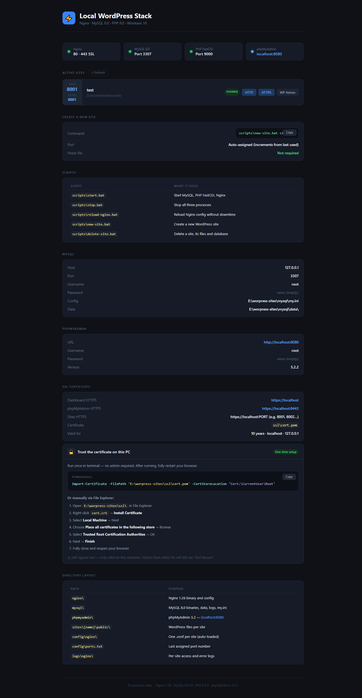

# Local WordPress Stack

This project sets up a local WordPress development stack on Windows with PHP, Nginx, MySQL, phpMyAdmin, and SSL support.

## Requirement

- Git/Gitbash must be installed on your PC for SSL setup.
- The initializer uses `openssl.exe` to generate the local SSL certificate.
- In this project, OpenSSL is expected from **Git for Windows** if a system OpenSSL install is not available.

## Root Directory Tree

```text
localhost-wp
├─ config
├─ logs
├─ mysql
├─ nginx
├─ php
├─ phpmyadmin
├─ scripts
├─ sites
└─ ssl
```

## Run

Run/Double click init.bat from the project root:

- `init.bat`

During setup, the initializer will automatically download the required packages if the corresponding directories are missing.

## Optional Manual Downloads

If you want to avoid download time during setup, download and extract these packages manually, then place them into the matching project directories before running the initializer:

- `nginx`:
  https://nginx.org/download/nginx-1.26.3.zip
- `mysql`:
  https://cdn.mysql.com/archives/mysql-8.0/mysql-8.0.36-winx64.zip
- `php`:
  https://downloads.php.net/~windows/releases/php-8.3.30-nts-Win32-vs16-x86.zip
- `phpmyadmin`:
  https://files.phpmyadmin.net/phpMyAdmin/5.2.2/phpMyAdmin-5.2.2-all-languages.zip

If those extracted directories already exist in root dir as `nginx`, `php`, `mysql`, and `phpmyadmin`, the initializer will use them instead of downloading again.

## SSL Note

The setup generates:

- `ssl/cert.pem`
- `ssl/key.pem`

If Git is not installed, SSL certificate generation may fail because `openssl.exe` cannot be found.

## Quick Glimpse  
Dashboard: https:localhost


