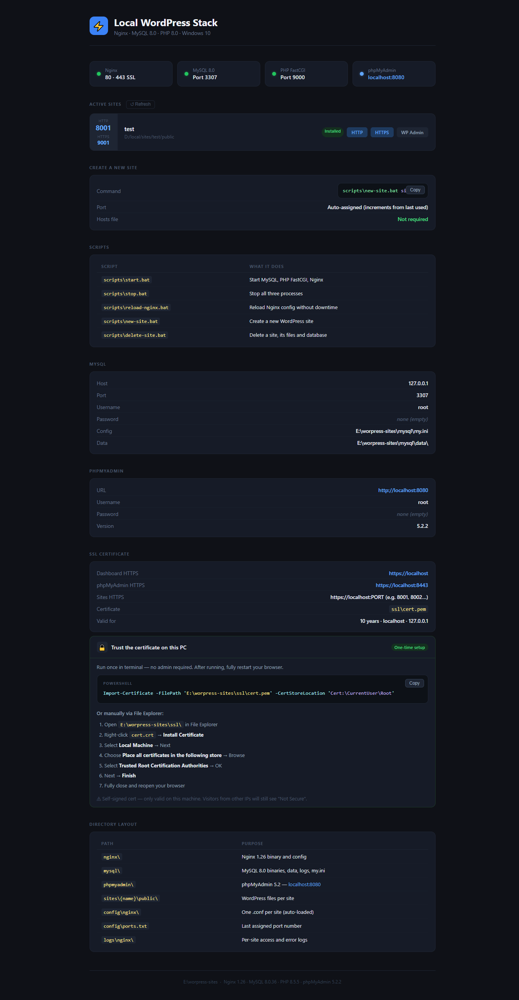

# localhost-wp

Release: `v2.0.0`

A self-contained local WordPress development stack for Windows — Nginx · MySQL 8.0 · PHP 8.3 · phpMyAdmin · SSL — managed through a GUI control panel.

---

## Requirements

- **Windows 10 or later**
- **Git for Windows** — required for `openssl.exe` to generate the local SSL certificate (if a system OpenSSL install is not available)
- **PowerShell** (built into Windows, no extra install needed)

---

## Getting Started

### 1. Clone the repository

```
git clone <repo-url> localhost-wp
```

### 2. Launch the control panel

Double-click **`control-panel.bat`** in the project root.

**First run (no binaries yet):**
The control panel detects that the stack has not been set up and shows a **Run Setup** button. Click it — setup will automatically download and configure everything directly inside the GUI activity log.

**Every run after that:**
The control panel opens directly into the normal interface. No setup prompt.

---

## What Setup Does

Setup runs once and handles everything automatically:

- Downloads and installs **Nginx 1.26**, **MySQL 8.0.36**, **PHP 8.3.30 NTS**, **phpMyAdmin 5.2.2**
- Configures `php.ini` (extensions, upload limits, CA trust)
- Configures MySQL (`my.ini`, initializes data directory)
- Generates a local root CA and SSL certificate for `localhost`, `127.0.0.1`, and the current machine IP
- Trusts the local CA for the current Windows user
- Writes Nginx configs (main, phpMyAdmin vhost, WordPress snippet)
- Configures phpMyAdmin

If the binaries already exist, setup skips re-downloading them.

### Optional: manual pre-download

To avoid download time during setup, extract these into their matching directories before running:

| Directory | Package |
|-----------|---------|
| `nginx\` | https://nginx.org/download/nginx-1.26.3.zip |
| `mysql\` | https://cdn.mysql.com/archives/mysql-8.0/mysql-8.0.36-winx64.zip |
| `php\` | https://downloads.php.net/~windows/releases/php-8.3.30-nts-Win32-vs16-x86.zip |
| `phpmyadmin\` | https://files.phpmyadmin.net/phpMyAdmin/5.2.2/phpMyAdmin-5.2.2-all-languages.zip |

---

## Control Panel

All stack and site management is done through the GUI — no terminal needed.

**Stack section**
| Button | What it does |
|--------|-------------|
| Start Stack | Starts MySQL, PHP FastCGI, and Nginx |
| Stop Stack | Backs up all databases, then stops the stack |
| Refresh status | Shows which services are running |

**Sites section**
| Button | What it does |
|--------|-------------|
| + New site | Creates a WordPress site (database + files + Nginx vhost) |
| phpMyAdmin | Opens phpMyAdmin at `http://localhost:8080` |
| Dashboard | Opens the stack dashboard at `https://localhost` |
| Refresh list | Reloads the site list |

Each site card shows its HTTP/HTTPS ports, server status, database status, wp-config status, and buttons to open the site, WP Admin, back up the database, or delete the site.

The **Open links with** selector at the top right of the Sites section controls whether site buttons open over HTTP or HTTPS, and whether links use `localhost` or the machine IP (useful for testing from a phone on the same network).

---

## Directory Layout

What is tracked in git:

```
localhost-wp/
├─ scripts/
│  ├─ control-panel.ps1       GUI only
│  ├─ cp-core.ps1             Utilities, status checks, helpers
│  ├─ cp-stack.ps1            Start/Stop/Reload stack logic
│  ├─ cp-sites.ps1            New site, backup, delete logic
│  └─ helper/
│     ├─ setup.ps1            First-time setup (downloads + configures)
│     ├─ ensure-php-runtime.ps1
│     ├─ start-php.ps1
│     ├─ generate-ssl.ps1
│     ├─ install-local-ca-mu-plugin.ps1
│     ├─ backup-databases.ps1
│     └─ create-nginx-conf.ps1
├─ control-panel.bat          Entry point — launch this
├─ index.html                 Stack dashboard (served at https://localhost)
├─ .gitignore
├─ README.md
└─ VERSION
```

Created by setup (gitignored — not committed):

```
nginx/       mysql/       php/       phpmyadmin/
ssl/         config/      logs/      sites/
```

---

## SSL

Setup generates:

- `ssl/rootCA.pem` + `ssl/rootCA.key` — local root CA
- `ssl/cert.pem` + `ssl/key.pem` — server certificate

The root CA is trusted for the current Windows user automatically. PHP is also configured to trust it via `curl.cainfo` and `openssl.cafile`, so `wp_remote_get()` works correctly on local HTTPS URLs.

The server certificate covers `localhost`, `127.0.0.1`, and the active machine IP at setup time. If you change networks and need a new IP in the cert, use **Start Stack** — it regenerates the SSL cert automatically.

---

## Backups

Database backups run automatically every time the stack is stopped via the GUI. They are also available on demand per site via the **Backup DB** button on each site card.

Backups are stored in `sites/<site-name>/sql/` with a rolling two-file rotation:

```
sites/mysite/sql/
├─ backup-2026-06-15-10-30.sql   ← latest
└─ backup-2026-06-14-22-00.sql   ← previous
```

---

## Dashboard


